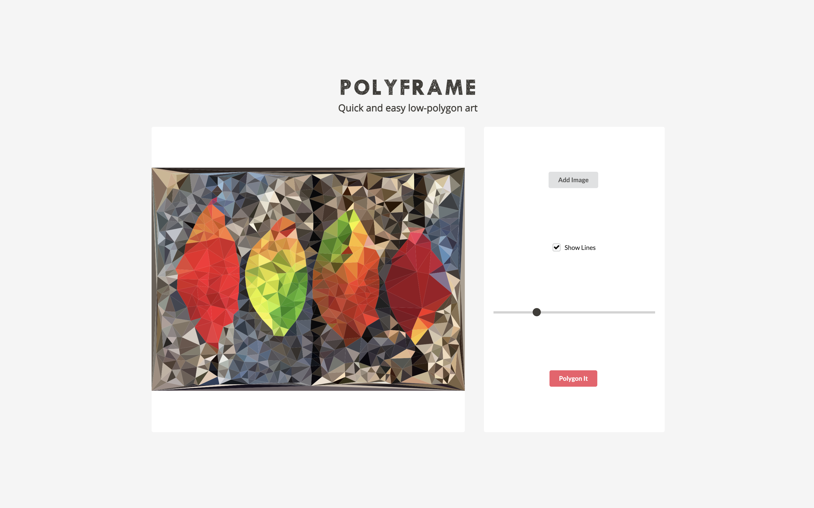

# Polyframe
React app for converting images to low-polygon



## Running Locally

Clone the project and run

```bash
$ npm install
```

```bash
$ npm start
```

This will open the app on http://localhost:8080

## License

The MIT License (MIT)
